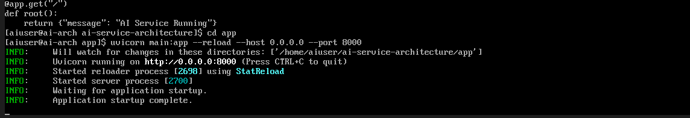
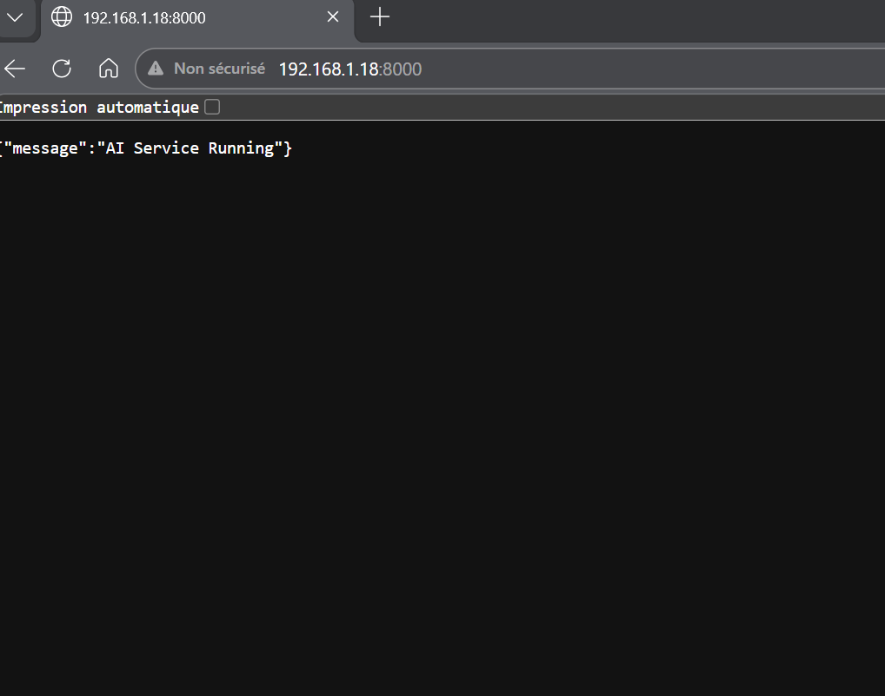
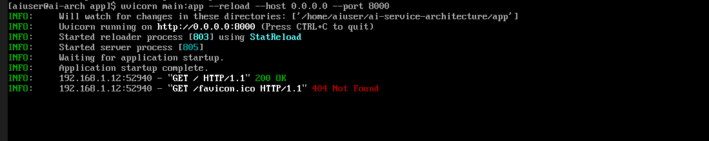
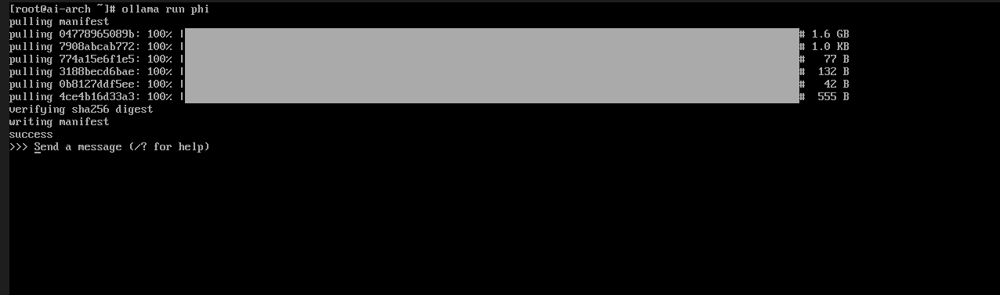

#
# AI Service Architecture  
## Compréhension pratique du fonctionnement réel d’un système IA

---

## Objectif du projet

Ce projet n’a pas pour but de simplement “utiliser” un modèle d’IA.

Il démontre une compréhension **technique, opérationnelle et architecturale** du fonctionnement réel d’un système d’intelligence artificielle déployé comme service.

Comprennent réellement AI :

- Comment on appelle un modèle
- Comment fonctionne l’inférence
- Comment un modèle devient un service HTTP
- Comment récupérer et analyser une réponse JSON
- Comment débugger un serveur IA

Ce projet répond précisément à ces points.

---

## Architecture du système

Le projet repose sur une architecture moderne orientée service :  

LLM (Ollama)    
⬇  
API Backend (FastAPI + Uvicorn)    
⬇  
Exposition HTTP    
⬇  
Client (curl / navigateur)      

---

## Résumé technique  

Ce projet démontre une compréhension **pratique et moderne** du fonctionnement réel d’un système d’intelligence artificielle déployé localement.   

Plutôt que d’utiliser une API distante, l’objectif était de maîtriser l’architecture complète :   

- Déploiement d’un modèle LLM en local (Ollama)  
- Exposition via une API REST (FastAPI + Uvicorn)  
- Communication HTTP  
- Manipulation et analyse de réponses JSON  
- Debug et analyse des logs serveur  
- Gestion des processus et ports réseau  
- Conteneurisation avec Docker  

Ce projet montre que :  

- Un modèle d’IA fonctionne comme un service réseau   
- L’inférence est un processus backend observable  
- L’IA s’intègre dans une architecture moderne (API-first)  
- Les logs, ports et processus sont essentiels à la compréhension du système  

---  

## Stack moderne utilisée   

- Arch Linux (environnement virtualisé)  
- FastAPI (framework backend moderne)  
- Uvicorn (serveur ASGI)  
- Ollama (LLM local)  
- Docker (conteneurisation)  
- curl (validation HTTP et tests d’API)  

---

#  AI Service Architecture

Compréhension pratique du fonctionnement réel d’un système IA exposé comme service backend.

---

## 1️⃣ FastAPI Server Running

Le backend démarre correctement via Uvicorn.

<p align="center">
  
</p>

---

## 2️⃣ HTTP JSON Response

Validation via navigateur : l’API retourne une réponse JSON valide.

<p align="center">
  
</p>

---

## 3️⃣ HTTP Request Logs

Analyse des logs serveur après requête HTTP.

On observe :
- `200 OK` pour l’endpoint principal
- `404 favicon.ico` (comportement normal du navigateur)
- Adresse IP privée locale (192.168.x.x)

<p align="center">
  
</p>

---

## 4️⃣ LLM Local avec Ollama

Téléchargement et démarrage du modèle LLM en local via Ollama.

Le modèle est prêt à recevoir des requêtes.

<p align="center">
  
</p>

---

---

## 5️⃣ HTTP Inference JSON Response

Après le chargement du modèle via Ollama, une requête `curl` est envoyée au backend afin de déclencher une inférence.

La réponse retournée est au format JSON et contient le texte généré ainsi que les métriques d’exécution du modèle.


---


## 🔁 Architecture Complète

```
Client (curl / navigateur)
        ↓
FastAPI (API REST)
        ↓
Ollama (LLM local)
        ↓
Réponse JSON


```

##  Ce que démontre ce projet

- Déploiement d’un LLM en local
- Exposition via API REST (FastAPI + Uvicorn)
- Communication HTTP
- Analyse des réponses JSON
- Lecture et compréhension des logs serveur
- Architecture IA orientée service


---

## 🔐 Perspective Sécurité   

La compréhension technique acquise à travers ce projet constitue une base solide pour évoluer vers :  

- AI Security  
- LLM Security  
- Prompt Injection Analysis  
- AI Red Teaming  

Comprendre comment un modèle est exposé, interrogé et intégré dans un service backend est une étape essentielle avant toute analyse de sécurité avancée.  

---

## ✅ Conclusion

Ce projet ne se limite pas à “utiliser” un modèle.  

Il démontre une compréhension réelle de son fonctionnement en environnement technique moderne.  
