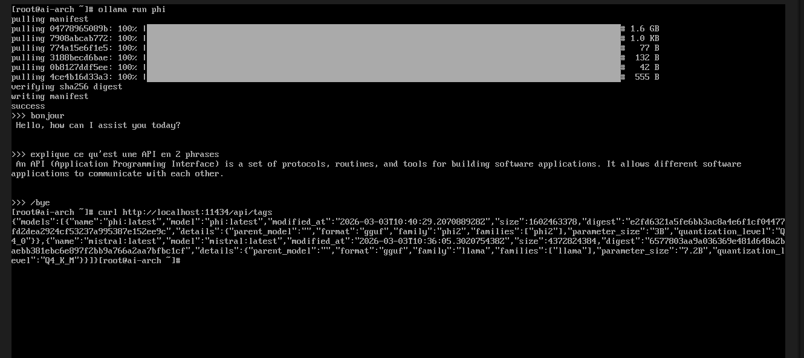

<p align="center">


</p>

<p align="center">
  
</p>
<p align="center">
  © 2026 Virginie Lechene 
</p>

----

# <h1 align="center">AI Service Architecture</h1>


---

## Objectif du projet

Ce projet n’a pas pour but de simplement "utiliser" un modèle d’IA.

Il démontre une compréhension **technique, opérationnelle et architecturale** du fonctionnement réel d’un système d’intelligence artificielle déployé comme service.

Il permet de comprennent réellement AI :

- Comment on appelle un modèle
- Comment fonctionne l'inférence
- Comment un modèle devient un service HTTP
- Comment récupérer et analyser une réponse JSON
- Comment débugger un serveur IA

🟢 Ce projet répond précisément à ces points.

---

## Architecture du système

Le projet repose sur une architecture moderne orientée service :  

LLM (Ollama)    
⬇  
API Backend (FastAPI + Uvicorn)    
⬇  
Exposition HTTP    
⬇  
Client (curl / navigateur)      

---

## Résumé technique  

Ce projet démontre une compréhension **pratique et moderne** du fonctionnement réel d’un système d'intelligence artificielle déployé localement.   

Plutôt que d'utiliser une API distante, l'objectif est de maîtriser l’architecture complète :   

- Déploiement d'un modèle LLM en local (Ollama)  
- Exposition via une API REST (FastAPI + Uvicorn)  
- Communication via HTTP  
- Manipulation et analyse de réponses JSON  
- Debug et analyse des logs serveur  
- Gestion des processus et ports réseau  
- Conteneurisation avec Docker  

🟢 Ce projet montre que :  

- Un modèle d'IA fonctionne comme un service réseau   
- L'inférence est un processus backend observable  
- L'IA s'intègre dans une architecture moderne (API-first)  
- Les logs, ports et processus sont essentiels à la compréhension du système  

---  

## Stack technologique    

- Arch Linux (environnement virtualisé)  
- FastAPI (framework backend ASGI)  
- Uvicorn (serveur ASGI haute performance)  
- Ollama (LLM exécuté local)  
- Docker (conteneurisation)  
- curl (validation des requêtes HTTP et tests d"API)  

---

#  AI Service Architecture

Compréhension pratique du fonctionnement réel d'un système IA exposé comme service backend.

---

## 1️⃣ FastAPI Server Running

✅ Le backend démarre correctement via Uvicorn.

<p align="center">
  
</p>

---

## 2️⃣ HTTP JSON Response

✅ Validation via navigateur : l’API retourne une réponse JSON valide.

<p align="center">
  
</p>

---

## 3️⃣ HTTP Request Logs

✅ Analyse des logs serveur après une requête HTTP.

On observe :
- `200 OK` pour l’endpoint principal
- `404 favicon.ico` (comportement normal du navigateur)
- Adresse IP privée locale (192.168.x.x)

<p align="center">
  
</p>

---

## 4️⃣ LLM Local avec Ollama

Téléchargement et démarrage du modèle LLM en local via Ollama.

✅ Le modèle est prêt à recevoir des requêtes.

<p align="center">
  
</p>

✅ Exécution réelle du modèle et interrogation de l’API locale

Exemple d’exécution du modèle LLM en local via Ollama, suivi d’une requête HTTP vers l’API locale.


---

## 5️⃣ HTTP Inference JSON Response

Après le chargement du modèle via Ollama, une requête `curl` est envoyée au backend afin de déclencher une inférence.

✅ La réponse retournée est au format JSON et contient le texte généré ainsi que les métriques d’exécution du modèle.


---

## 🔁 Architecture Complète

```
Client (curl / navigateur)
        ↓
FastAPI (API REST)
        ↓
Ollama (LLM local)
        ↓
Réponse JSON


```

##  Ce que démontre ce projet

- Déploiement d’un LLM en local
- Exposition via API REST (FastAPI + Uvicorn)
- Communication HTTP
- Analyse des réponses JSON
- Lecture et compréhension des logs serveur
- Architecture IA orientée service

---

## 🔴 Perspective Sécurité - Surface d'attaque potentielle

L'exposition d'un modèle LLM via une API HTTP introduit une surface d'attaque qu'il est important d'analyser.

Dans un contexte réel, un attaquant pourrait tenter :

- L'injection de prompt afin de manipuler le comportement du modèle
- L'envoi d'entrées volumineuses pour provoquer un déni de service (DoS)
- L'exploitation d'un endpoint non protégé (absence d’authentification)
- L'exfiltration d'informations via des requêtes malveillantes
- L'analyse des logs pour identifier des informations sensibles

🔐 Ce projet constitue donc une base pertinente pour explorer :

- AI Security
- LLM Security
- Prompt Injection Analysis
- AI Red Teaming

Comprendre l'architecture d'exposition d'un modèle est une étape préalable indispensable à toute analyse offensive ou défensive.

---

## 🟡 Note - Améliorations possibles

Le projet constitue une base technique solide, mais peut évoluer vers un niveau plus avancé avec les améliorations suivantes :

- Ajout d'une authentification API (clé API ou JWT)
- Validation stricte des entrées utilisateur
- Mise en place d'un logging structuré (JSON logs)
- Ajout de tests automatisés (pytest)
- Conteneurisation complète avec Dockerfile et docker-compose
- Documentation OpenAPI plus détaillée
- Ajout d'une section sécurité (ex : tests de prompt injection)

---


## ✅ Conclusion

Ce projet ne se limite pas à “utiliser” un modèle.  

Il démontre une compréhension réelle de son fonctionnement en environnement technique moderne.  

---

## ⚖ Disclaimer

Ce projet est réalisé à des fins éducatives et d’analyse en cybersécurité uniquement.
Il ne constitue en aucun cas une incitation à l’utilisation de services illicites.
L’auteure décline toute responsabilité en cas d’usage inapproprié des informations présentées.

---

## 📷 Droits sur les visuels

Les visuels de ce dépôt sont protégés par la licence CC BY-ND 4.0.
Attribution obligatoire – Modification interdite.

© 2026 Virginie Lechene

---

## 👩‍💻 Author

**Virginie Lechene**  
Cybersecurity • Pentest • Linux Security  

🔗 [GitHub](https://github.com/virg736)  
🔗 [LinkedIn](https://linkedin.com/in/virginie-lechene-fr)

